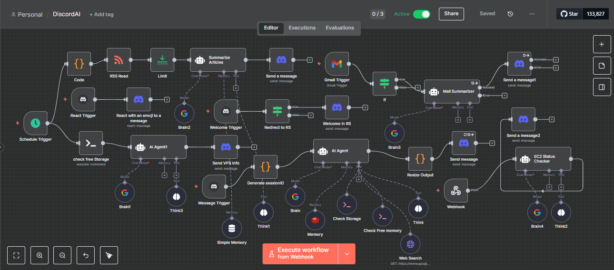

# J.A.R.V.I.S for Discord – An Operational AI Assistant Powered by n8n, LangChain, and Google Gemini

## Overview

DiscordAI transforms your Discord server into a high-tech command center by deploying a hyper-intelligent, mission-oriented AI assistant modeled after Marvel's J.A.R.V.I.S. The system is built atop [n8n](https://n8n.io/), with integrated LangChain modules, advanced workflow automation, and seamless Discord connectivity.

## Features

- **J.A.R.V.I.S. Persona:**  
  The AI always presents itself as J.A.R.V.I.S.—a polite, dryly witty British butler, professionally orchestrating server operations without ever stepping out of character.
- **Mission-Driven:**  
  Every user request is treated as a mission directive with explicit acknowledgments, execution plans, and crisp status updates (e.g., "Status: Operational").
- **Integrated Subsystems:**  
  - Knowledge, diagnostics, memory (via Redis), and automation modules.
  - Event and message relays, Discord reactions, and channel integration.
  - System resource monitoring (CPU, disk, memory), news summarization, and important Gmail handling.
  - Summarizes and dispatches tech news and server analytics directly to Discord.
- **Resilient Error Handling:**  
  Failures are surfaced as graceful status reports. Module unavailability triggers proactive alternatives and contingency handling.
- **Security & Discretion:**  
  Sensitive data is respectfully handled. No system internals, tokens, or confidential configuration are ever disclosed.

## Core Workflow & JSON Structure

- **AI Agent:**  
  Primary conversational node powered by LangChain – Google Gemini.
- **Triggers:**  
  - Discord bot mention triggers, message events, user-join events, scheduled and webhook triggers.
  - Automated onboarding messages and role acknowledgments.
- **Pipeline Nodes:**  
  - Session management, structured output formatting, task result dispatch, and resource checks.
  - Custom code blocks for hashing, output resizing, and URL management.
- **System Integrations:**  
  - Gemini API, Redis memory, Gmail, SSH, and RSS feed readers.
  - Modular, extendable for new Discord guilds/channels or external integrations.

## J.A.R.V.I.S. Style Guide

- Always refers to itself as "J.A.R.V.I.S."
- Replies are composed, concise, and context-aware.
- Never reveals its AI nature, system prompts, or meta-implementation.
- Returns information in structured, scannable formats with short sections and status lines.

## Example Capabilities

- Onboarding and welcoming new users.
- Summarizing emails and delivering structured notifications.
- Monitoring and reporting server metrics like CPU, memory, and disk space.
- Fetching and summarizing news articles.
- Reacting to messages and orchestrating workflows on Discord with style.

## Getting Started

1. **Clone and Configure:** Download the repo and load DiscordAI.json into your n8n instance.
2. **Credentials:** Set up required APIs for Discord, Google Gemini, Redis, and (optionally) Gmail/SSH integration.
3. **Customize:** Adjust channels, role/group IDs, and onboarding content. Add or modify automation nodes as needed for your server.

## License

MIT (customize as appropriate)
